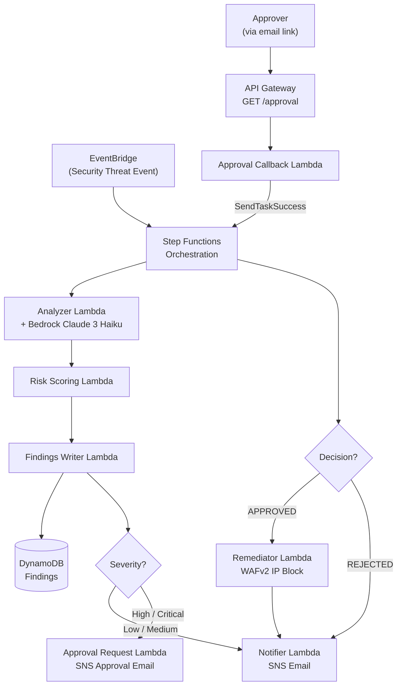

# AWS AI Security Orchestration

An event-driven, serverless security response workflow on AWS for handling suspicious cloud events.

## 1) Problem Definition

Security teams receive many alerts and often spend too much time on repetitive triage + response actions.
This project demonstrates a practical workflow that can:

- normalize and score incoming findings,
- require human approval for high-risk actions,
- and automatically apply remediation (WAF IP block) after approval.

This maps to a real-world SOC use case while staying demo-friendly for a hackathon.

## 2) What the system does

Pipeline:

Detection → Analysis → Risk Scoring → Findings Storage → (Approve?) → Remediation → Notification

High-level behavior:

- Low/medium findings: notify only
- High/critical findings: require human approval first
- Approved malicious IP events: IP added to WAF IP set

## 3) Architecture

### Architecture Diagram



### Data Flow

1. Custom security event arrives on EventBridge
2. Step Functions starts the orchestration workflow
3. Analyzer Lambda creates a normalized finding
4. Risk Scoring Lambda computes severity and approval requirement
5. Findings Writer stores the finding in DynamoDB
6. If high/critical, Approval Request Lambda sends approve/reject links via SNS email
7. Approval Callback API (API Gateway + Lambda) resumes workflow using Step Functions task token
8. Remediator updates WAF IP set for approved findings
9. Notifier sends final status update via SNS

## 4) AWS Services Used

| Service | Purpose |
|------|------|
| EventBridge | Security event ingestion |
| Step Functions | Workflow orchestration |
| Lambda | Analysis, scoring, approval, remediation, notifications |
| Amazon Bedrock (Claude 3 Haiku) | AI-powered threat enrichment and risk summarization |
| DynamoDB | Findings storage |
| SNS | Notification and approval emails |
| API Gateway | Approval callback endpoint |
| WAFv2 | Malicious IP blocklist |
| CloudWatch Logs | Workflow and Lambda observability |

## 5) Repository Structure

```text
lambdas/
  analyzer/
  approval_callback/
  approval_request/
  findings_writer/
  notifier/
  remediator/
  risk_scoring/

statemachine/
  security_orchestration.asl.json

terraform/
  apigateway.tf
  dynamodb.tf
  eventbridge.tf
  iam.tf
  lambda.tf
  locals.tf
  outputs.tf
  providers.tf
  sns.tf
  stepfunctions.tf
  variables.tf
  waf.tf
```

## 6) GenAI Usage

The **Analyzer Lambda** calls **Amazon Bedrock** (Claude 3 Haiku) to enrich every incoming security finding before it is scored or stored.

**What the AI does:**
- Classifies the event into a `threat_category` (e.g. Privilege Escalation, Lateral Movement)
- Generates an `ai_summary`: a 2-sentence risk assessment explaining the threat and its potential impact
- Suggests a `recommended_action`: a single concrete immediate response step

**Model:** `anthropic.claude-3-haiku-20240307-v1:0` via Amazon Bedrock — fast, low-cost, available in us-east-1.

**How the AI output is used:**
- Surfaced in the human approval email so the approver gets AI context alongside the raw finding
- Included in the final SNS notification alongside remediation outcomes
- Stored in DynamoDB as part of the finding record for audit purposes

**Design intent:** The AI enrichment is additive — the deterministic rule-based scoring in `risk_scoring/handler.py` still drives the approval gate. This keeps behavior predictable and explainable while the AI provides human-readable context that a rule engine cannot. If Bedrock is unavailable, the workflow continues with fallback values and never fails due to AI unavailability.

## 7) Demo Walkthrough

### Demo story

1. Inject sample high-risk security event
2. Show Step Functions execution path reaches approval step
3. Approve from email link
4. Show workflow resumes and updates WAF IP set
5. Show final finding status and remediation details in DynamoDB/logs

### Sample event payload (high severity)

```json
{
  "source": "custom.security",
  "detail-type": "Security Threat Event",
  "detail": {
    "event_type": "iam_policy_change",
    "resource_id": "iam-role/admin-role",
    "actor": "unknown-principal",
    "severity_hint": "high",
    "summary": "Unexpected IAM policy escalation detected",
    "ip_address": "203.0.113.10"
  }
}
```

## 8) Verification Checklist (for judges)

- [ ] Event appears in EventBridge/Step Functions execution history
- [ ] Finding record stored in DynamoDB with `finding_id`
- [ ] For high/critical events, approval email is received
- [ ] Approve/reject callback updates finding status
- [ ] Approved malicious IP is added to WAF IP set
- [ ] Final notification includes remediation and approval status

## 9) Hackathon Tradeoffs (intentional)

- Deterministic rule-based scoring drives the approval gate (keeps behavior predictable and demo-explainable); AI enrichment is additive
- Email-link approval workflow for speed of implementation
- Single-table DynamoDB model for fast iteration
- Minimal test suite focused on critical logic paths
- Static shared approval token (sufficient for a demo; production would use per-finding HMAC with expiry)

## 10) Future Improvements

Possible enhancements include:

- GuardDuty / Security Hub integration for real alert sources
- Replace rule-based scoring with AI-driven severity inference
- SIEM integration
- Multi-account security orchestration
- Automated incident investigation workflows
- Per-finding HMAC approval tokens with expiry

## Author

Partha Patnaik  
AWS Cloud Architect | DevOps | Cloud Security  
GitHub: https://github.com/parthapatnaik
